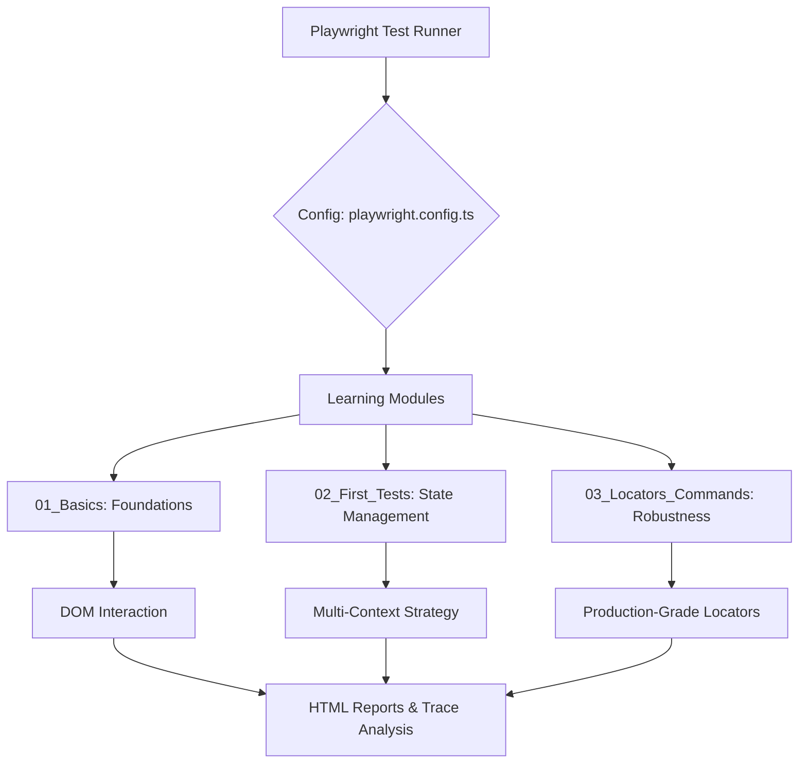

# 🎓 Mastery of Playwright: A Learning Journey


Welcome to my digital laboratory for End-to-End (E2E) testing. This repository is a documented journey of mastering **Playwright**, progressing from foundational browser interactions to complex context management and precision locators.

---

## 🗺️ The Learning Roadmap

I've structured this project as a structured curriculum. Each module represents a specific skill set acquired during the learning process.

### 🟢 Stage 1: The Foundations (`01_Basics`)
*Focusing on the core mechanics of how Playwright interacts with the web.*
- **Key Labs**:
  - `Lab209.spec.ts`: Core interaction patterns.
  - `Lab210_Test_Annoations.spec.ts`: Mastering test annotations for better suite organization.
- **Tooling**: Includes `Util.ts` for shared helper logic.

### 🔵 Stage 2: Context & State (`02_First_Tests`)
*Moving beyond a single page to simulate multi-user scenarios and isolated environments.*
- **Core Concepts**: `BrowserContext`, multi-page handling, and manual context configuration.
- **Practical Application**:
  - `211` through `218`: Progressing from first runs to advanced context reuse.
  - **Tasks**: Deep dives into `OneBrowser_MultipleContext` and `OneContext_MultiplePages` scenarios.

### 🔴 Stage 3: Precision & Scale (`03_Locators_Commands`)
*The art of writing robust selectors and mastering navigation commands.*
- **Core Concepts**: Advanced Locators, `goto` commands, and real-world automation.
- **Applied Projects**:
  - `219` to `222`: Testing diverse sites including `automation.vwo.com` and `Command IQ`.
  - **Capstone**: `Project2_Cura_Navigation.spec.ts` — a complete automation flow for Cura Healthcare.

---

## 🏗️ Engineering Architecture

The project follows a modular design to ensure that each learning milestone can be tested and debugged in isolation.

### High-Level Design


---

## 📁 Repository Blueprint

```text
LearningPlaywrightFundamentals/
├── .github/                # 🚀 CI/CD Workflows (GitHub Actions)
├── tests/                  # 🧪 The Laboratory
│   ├── 01_Basics/          # 🐣 Foundations
│   │   ├── Lab209.spec.ts
│   │   ├── Lab210_Test_Annoations.spec.ts
│   │   └── Util.ts
│   ├── 02_First_Tests/     # 🧠 Context & Page Management
│   │   ├── Task/           # 🛠️ Practical context exercises
│   │   │   ├── 01_OneBrowser_MultipleContext.spec.ts
│   │   │   ├── 02_OneBrowser_MutipleContext_MultiplePages.spec.ts
│   │   │   └── 03_OneContext_MultiplePages.spec.ts
│   │   └── [211-218].spec.ts # Core context learning labs
│   └── 03_Locators_Commands/ # 🎯 Precision Targeting
│       ├── Task/           # 🏥 Project: Cura Healthcare Navigation
│       │   └── Project2_Cura_Navigation.spec.ts
│       └── [219-222].spec.ts # Locator & Command labs
├── playwright-report/      # 📊 Results & Insights
├── test-results/           # 📸 Evidence (Screenshots & Videos)
├── playwright.config.ts    # ⚙️ Global Configuration
└── package.json            # 📦 Project Dependencies
```

---

## ⚙️ Quick Start Guide

### Installation
```bash
# Clone the repository
git clone <repository-url>
cd LearningPlaywrightFundamentals

# Setup the environment
npm install
npx playwright install
```

### Running the Labs
| Goal | Command |
| :--- | :--- |
| **Full Suite Audit** | `npx playwright test` |
| **Focus on Basics** | `npx playwright test tests/01_Basics` |
| **Context Deep Dive** | `npx playwright test tests/02_First_Tests` |
| **Locator Project** | `npx playwright test tests/03_Locators_Commands` |
| **Interactive Debugging** | `npx playwright test --ui` |
| **Analyze Results** | `npx playwright show-report` |

---

## 🚀 CI/CD: The Quality Gate

Integrated GitHub Actions ensure that every new lab added maintains the stability of the existing suite.

**The Pipeline Logic:**
`Push` $\rightarrow$ `Install Deps` $\rightarrow$ `Browser Setup` $\rightarrow$ `Headless Execution` $\rightarrow$ `Artifact Upload`

---

## 🛠️ Technical Stack

- **Language**: TypeScript (Strict mode)
- **Framework**: Playwright Test
- **Reporting**: HTML Reports
- **CI**: GitHub Actions
- **Analysis**: Playwright Trace Viewer (Retained on failure)
