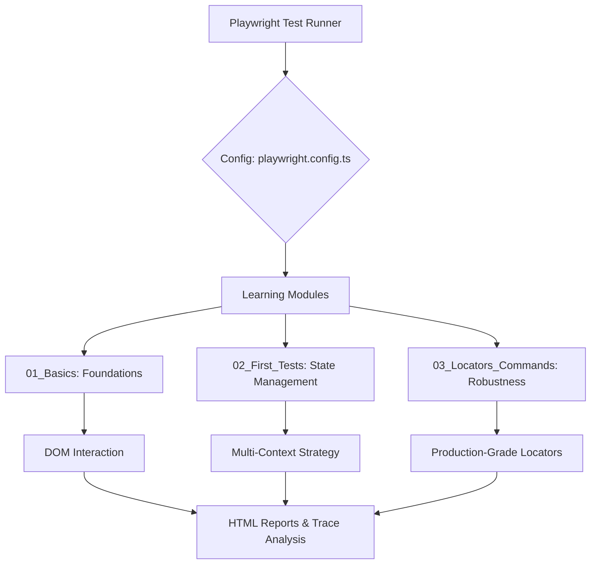

# 🎓 Mastery of Playwright: A Learning Journey


Welcome to my digital laboratory for End-to-End (E2E) testing. This repository isn't just a collection of scripts; it's a documented journey of mastering **Playwright**, from the first "Hello World" test to architecting scalable automation for complex web applications.

---

## 🗺️ The Learning Roadmap

I've structured this project as a curriculum. Each module represents a milestone in the journey from a beginner to an automation engineer.

### 🟢 Stage 1: The Foundations (`01_Basics`)
*The "Aha!" moment where I learned how Playwright interacts with the DOM.*
- **Focus**: Basic navigation, clicking, and assertions.
- **Key Milestone**: Mastering test annotations to manage flaky tests and organize suites.

### 🔵 Stage 2: Context & State (`02_First_Tests`)
*Moving beyond a single page. Learning how to simulate multiple users and isolated environments.*
- **Focus**: `BrowserContext`, multi-page handling, and session isolation.
- **Challenge**: Implementing complex scenarios where one browser manages multiple independent user contexts.

### 🔴 Stage 3: Precision & Scale (`03_Locators_Commands`)
*The art of writing robust selectors that don't break on every UI change.*
- **Focus**: Advanced Locators, dynamic navigation, and real-world application.
- **Capstone**: Automating the **Cura Healthcare** navigation flow—applying everything learned to a real project.

---

## 🏗️ Engineering Architecture

To ensure this learning journey scales into a professional framework, I've implemented a modular design.

### High-Level Design


---

## 📁 Repository Blueprint

```text
LearningPlaywrightFundamentals/
├── .github/                # 🚀 The Safety Net (GitHub Actions CI)
├── tests/                  # 🧪 The Laboratory
│   ├── 01_Basics/          # 🐣 First steps in automation
│   │   └── Lab209.spec.ts
│   ├── 02_First_Tests/     # 🧠 Mastering Browser State
│   │   ├── Task/           # 🛠️ Context reuse exercises
│   │   └── *.spec.ts       # Page & Context logic
│   └── 03_Locators_Commands/ # 🎯 Precision Targeting
│       ├── Task/           # 🏥 Project: Cura Healthcare Navigation
│       └── *.spec.ts       # Command-based automation
├── playwright-report/     # 📊 Results & Insights
├── test-results/           # 📸 Evidence (Screenshots & Videos)
├── playwright.config.ts    # ⚙️ The Brain (Global Configuration)
└── package.json            # 📦 Dependencies
```

---

## 🖼️ Visual Evidence

### 📈 Test Execution Flow


### 📊 Reporting Dashboard


---

## ⚙️ Quick Start Guide

### Installation
```bash
# Clone the journey
git clone <repository-url>
cd LearningPlaywrightFundamentals

# Setup the environment
npm install
npx playwright install
```

### Running the Labs
| Goal | Command |
| :--- | :--- |
| **Full Audit** | `npx playwright test` |
| **Focus on Basics** | `npx playwright test tests/01_Basics` |
| **Interactive Debugging** | `npx playwright test --ui` |
| **Analyze Results** | `npx playwright show-report` |

---

## 🚀 CI/CD: The Quality Gate

I've integrated a CI pipeline to ensure that as I add new labs, the existing ones remain stable. Every push triggers a headless execution in the cloud.

**The Pipeline Logic:**
`Push` $\rightarrow$ `Install Deps` $\rightarrow$ `Browser Setup` $\rightarrow$ `Headless Execution` $\rightarrow$ `Artifact Upload`

---

## 🛠️ Technical Stack

- **Language**: TypeScript (Strict mode for maximum type safety)
- **Framework**: Playwright Test
- **Reporting**: Allure-style HTML Reports
- **CI**: GitHub Actions
- **Analysis**: Playwright Trace Viewer (Retained on failure)
