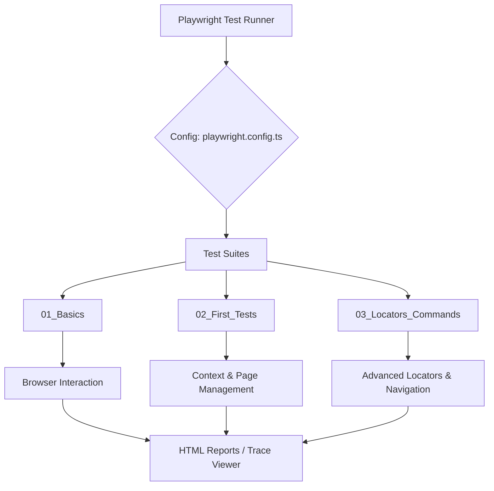

# 🚀 Learning Playwright Fundamentals


An enterprise-grade end-to-end (E2E) testing repository designed for mastering the fundamentals of browser automation. This project follows a structured curriculum, progressing from basic interactions to complex context and locator strategies.

---

## 🏗️ Architecture

The project is built on a modular architecture to ensure scalability and maintainability. It separates test logic by learning modules, allowing for isolated execution and focused debugging.

### High-Level Design


---

## 📁 Project Structure

```text
LearningPlaywrightFundamentals/
├── .github/                # CI/CD Workflows (GitHub Actions)
├── tests/                  # Test Suites
│   ├── 01_Basics/          # Fundamentals & Basic Labs
│   │   ├── Lab209.spec.ts
│   │   └── Lab210_Test_Annotations.spec.ts
│   ├── 02_First_Tests/     # Context & Page Management
│   │   ├── Task/           # Practical exercises for context reuse
│   │   └── *.spec.ts       # Browser context & page logic
│   └── 03_Locators_Commands/ # Locators, Navigation & Real-world projects
│       ├── Task/           # Project-based exercises (e.g., Cura Navigation)
│       └── *.spec.ts       # Command-based automation
├── playwright-report/     # Generated Test Reports
├── test-results/           # Artifacts, Screenshots, Videos
├── playwright.config.ts    # Global Playwright Configuration
├── tsconfig.json           # TypeScript Compiler Options
└── package.json            # Project Dependencies & Scripts
```

---

## 🖼️ Visuals & Reports

### Test Execution Flow


### Report Sample


---

## ⚙️ Getting Started

### Prerequisites
- **Node.js**: Latest LTS recommended
- **npm**: Package manager

### Installation
```bash
# 1. Clone the repository
git clone <repository-url>
cd LearningPlaywrightFundamentals

# 2. Install dependencies
npm install

# 3. Install Playwright browsers
npx playwright install
```

---

## 🧪 Test Execution

### Execution Commands
| Command | Description |
| :--- | :--- |
| `npx playwright test` | Run all tests in the project |
| `npx playwright test tests/01_Basics` | Run tests in the Basics module |
| `npx playwright test --ui` | Launch Playwright UI Mode for debugging |
| `npx playwright show-report` | Open the generated HTML report |

### Debugging Tools
- **Trace Viewer**: Use `npx playwright test --trace on` to record detailed execution traces.
- **UI Mode**: Best for rapid iteration and visual selector inspection.

---

## 🚀 CI/CD Integration

This project is configured for automated quality gates using GitHub Actions.

### Pipeline Workflow
1. **Trigger**: Push to `main` or Pull Request.
2. **Environment**: Ubuntu-latest with Node.js.
3. **Steps**:
   - Checkout code.
   - Install dependencies.
   - Install browsers.
   - Run tests in headless mode.
   - Upload test results and HTML reports as artifacts.

### Proposed Workflow File (`.github/workflows/playwright.yml`)
```yaml
name: Playwright Tests
on: [push, pull_request]
jobs:
  test:
    timeout-minutes: 60
    runs-on: ubuntu-latest
    steps:
    - uses: actions/checkout@v4
    - uses: actions/setup-node@v4
      with: {node-version: 20}
    - run: npm ci
    - run: npx playwright install --with-deps
    - run: npx playwright test
    - uses: actions/upload-artifact@v4
      if: always()
      with: {name: playwright-report, path: playwright-report/}
```

---

## 🛠️ Configuration Details

### TypeScript
The project utilizes strict typing via `tsconfig.json` to ensure robust test scripts and better IDE support.

### Playwright Config
`playwright.config.ts` is tuned for:
- **Parallelism**: Optimized worker count for faster execution.
- **Retries**: Configured for CI stability.
- **Tracing**: Set to `retain-on-failure` for efficient debugging.
