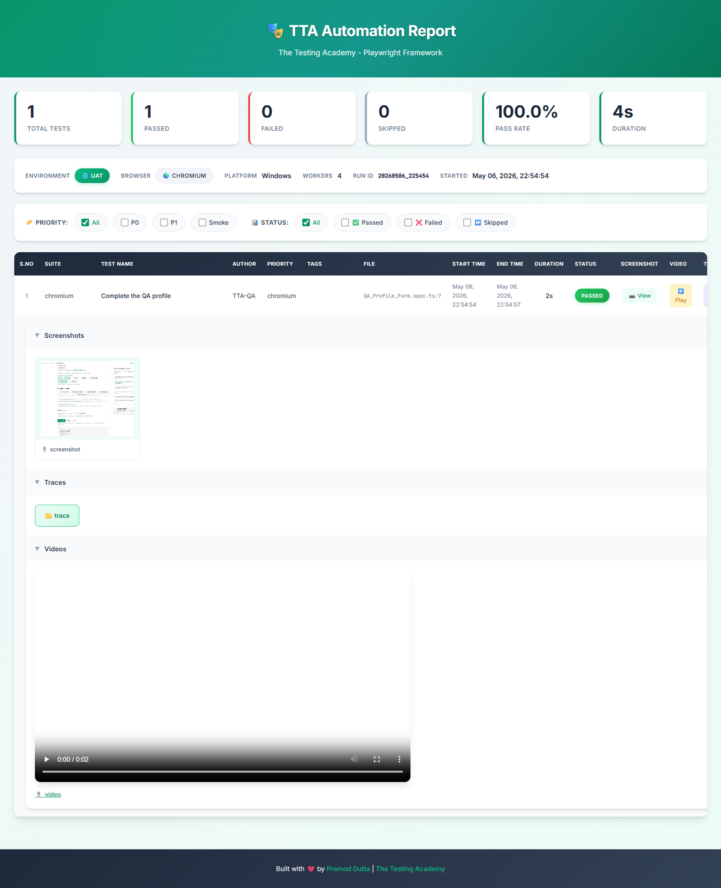

# QA Profile Form Automation

This project contains Playwright automated tests for validating the QA Profile Form on The Testing Academy practice page.

## 🚀 Project Overview
The goal of this automation is to verify the functionality of the QA profile form, ensuring that user inputs (First Name, Last Name, Gender, Profession, Technical Skills, and Continents) are correctly captured and displayed in the JSON output upon submission.

## 🛠️ Implementation Details
- **Target Page**: [QA Profile Form Practice](https://app.thetestingacademy.com/playwright/tables/practice)
- **Tool**: Playwright
- **Language**: TypeScript
- **Key Verifications**: 
    - Form field interaction (Textboxes, Radio buttons, Checkboxes).
    - Validation of the generated JSON response using `expect().toContainText()`.

## 📂 Folder Structure
- `QA_Profile_Form.spec.ts`: Contains the test script for the profile form.
- `screenshot.png`: Visual reference of the form/test execution.

## 🖼️ Visual Reference


## ⚙️ How to Run
To run the tests for this specific project, use the following command:
```bash
npx playwright test tests/Projects/Project_5_QA_Portfolio/QA_Profile_Form.spec.ts
```
