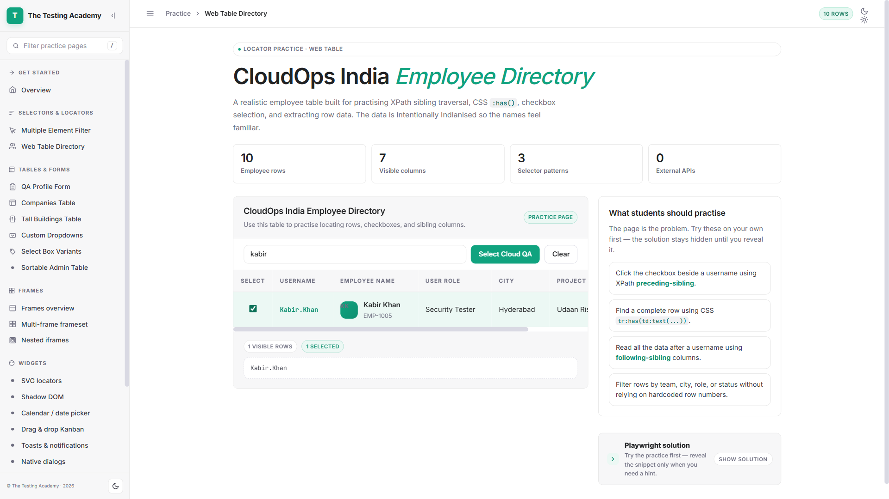

# Project 6: Web Table Automation

This project demonstrates the automation of a web table using Playwright. The test focuses on searching for a specific employee in a web table and verifying the selection output.

## 🚀 Project Overview
The objective of this project is to automate the interaction with a dynamic web table, including:
- Navigating to the target URL.
- Using a search box to filter table data.
- Selecting a specific row based on the text content.
- Validating that the selected value is correctly displayed in the output section.

## 🛠️ Tech Stack
- **Language:** TypeScript
- **Framework:** [Playwright](https://playwright.dev/)
- **Test Runner:** Playwright Test

## 📄 Code Implementation
The test logic is implemented in `WebTable.spec.ts`.

### Test Scenario:
1. **Navigate** to `https://app.thetestingacademy.com/playwright/webtable`.
2. **Search** for 'kabir' in the employee search box.
3. **Select** the checkbox for 'Kabir.Khan' from the filtered results.
4. **Verify** that the selected output displays 'Kabir.Khan'.

```typescript
import { test, expect } from '@playwright/test';

test('Web Table test', async ({ page }) => {
    // Navigate to the Web Table page
    await page.goto('https://app.thetestingacademy.com/playwright/webtable');

    // Click on the search box and type 'kabir'
    await page.locator('#employee-search').click();
    await page.locator('#employee-search').fill('kabir');

    // Search the results and click on the checkbox for 'Kabir.Khan'
    await page.locator("tr:has(td:text('Kabir.Khan'))").locator("td").first().click();

    // Validate the Selected Output has the text 'Kabir.Khan'
    await expect(page.locator('#selected-output')).toHaveText('Kabir.Khan');
});
```

## 📊 Test Report
The test was executed successfully with a 100% pass rate.

- **Report File:** `/tta-report/report_20260507_231842.html`
- **Environment:** UAT
- **Browser:** Chromium
- **Platform:** Windows
- **Duration:** 3s
- **Status:** ✅ Passed

### 📸 Execution Screenshot


---
*Built with ❤️ by [The Testing Academy](https://thetestingacademy.com)*
